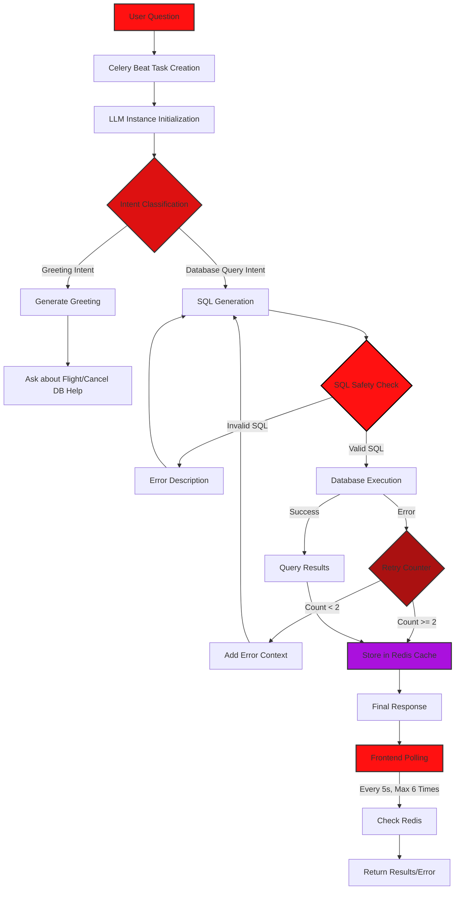

# Flight Database Query System Documentation
## Core Architecture
- **FastAPI Framework**: Handles HTTP requests and API routing
- **Asynchronous Processing**: Celery for background task management
- **Data Storage**:
  - PostgreSQL for main database
  - Redis for task queuing and caching
- **Docker**: Full containerization for easy deployment and scaling

## System Flow Diagram



## Installation Guide for AssignmentTask

## Prerequisites
- Python 3.10
- PostgreSQL
- Redis
- Celery
- LLM 

## Step 1: Clone the Repository
```bash
git clone https://github.com/prabigya-pathak108/AssignmentTask.git
cd AssignmentTask
```

## Step 2: Set Up Python Virtual Environment
```bash
# Create virtual environment
python -m venv venv

# Activate virtual environment
# For Windows
.\venv\Scripts\activate
# For Linux/Mac
source venv/bin/activate
```

## Step 3: Install System Dependencies
### For Ubuntu/Debian:
```bash
sudo apt-get update
sudo apt-get install -y build-essential libpq-dev
```

### For MacOS:
```bash
brew install postgresql
```

### For Windows:
- Install Build Tools for Visual Studio
- PostgreSQL development files are included with the PostgreSQL installation

## Step 4: Install Python Dependencies
```bash
pip install -r requirements.txt
```

## Step 5: Install and Configure PostgreSQL
1. Install PostgreSQL 13
2. Create a new database and user:
```sql
psql -U postgres
CREATE DATABASE your_database_name;
CREATE USER your_username WITH PASSWORD 'your_password';
GRANT ALL PRIVILEGES ON DATABASE your_database_name TO your_username;
```

## Step 6: Install and Start Redis
### For Ubuntu/Debian:
```bash
sudo apt-get install redis-server
sudo systemctl start redis-server
```

### For MacOS:
```bash
brew install redis
brew services start redis
```

### For Windows:
- Download Redis for Windows from https://github.com/microsoftarchive/redis/releases
- Start Redis server using `redis-server`
- You can use Docker Desktop and run container there

## Step 7: Configure Environment Variables
Copy .env.sample file into .env file and replace all values with your credentials

## Step 8: Start the Application
1. Start FastAPI server:
```bash
uvicorn server:app --host 0.0.0.0 --port 8000 --reload
```

2. Start Celery worker (in a new terminal):
```bash
# Activate virtual environment first
celery -A helpers.celery_tasks.celery_worker.celery_app worker --loglevel=info
```

## Verify Installation
1. FastAPI server should be running at: http://localhost:8000
2. Access API documentation at: http://localhost:8000/docs
3. Redis should be running on port 6379
4. PostgreSQL should be running on port 5432
5. Celery worker should be active and processing tasks